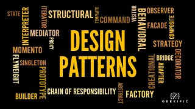

Coding is like exploring a big, wild jungle. Imagine you're on a musical adventure, creating a symphony of code. Design patterns are like musical notes – they guide us through the coding jungle,
 helping us solve tricky problems in a smart way. Let me take you through this journey, showing you how design patterns are like the musical instruments in our coding orchestra.

---

**The Melody: What Are Design Patterns?**

Think of design patterns as the cool tunes playing in our code. They're smart ways to solve common problems we face while building software. Picture the Singleton pattern as the lead singer – it makes sure there's only one of its kind,
 just like a solo artist in the spotlight. The Singleton pattern is your go-to melody when you want a single point of control, like managing a unique database connection. The Observer pattern is like the teamwork of the brass instruments,
  where one part tells the others what's happening. Imagine a weather app notifying you about changes – that's the Observer pattern in action. The Strategy pattern is the flexibility of a pianist, changing tunes on the fly.
  When you need to switch algorithms without changing the client code, the Strategy pattern lets you dance through different tunes seamlessly. These patterns bring order to our coding melody, making sure we don't end up in a tangled mess of code.

---

**The Beat: How I've Used Design Patterns**

Now, let me share how I've played with these coding tunes in my projects. The Adapter pattern is like my conductor's wand, making different parts work together smoothly. It's like getting a guitarist and a drummer to jam together, even if they speak different musical languages.
Let's say you have an old system with a new one – the Adapter pattern helps them play a beautiful duet. The Decorator pattern is my way of adding cool decorations to my code, just like a musician adding special touches to a song. It allows me to add new features to an object without altering its structure.
Think of it as adding fancy guitar solos to a song without changing the rhythm. The Composite pattern is my secret sauce for organizing different pieces of code, like a conductor harmonizing a whole orchestra. When you must treat individual objects and compositions uniformly,
the Composite pattern lets you create a symphony of components. Each plays its part, contributing to the grand performance of the code.

---

**The Encore: Playing in Harmony with Design Patterns**

To sum it up, design patterns are like the seasoned players in our code symphony. I use them to make my code strong and flexible, just like a maestro uses musical techniques to make a song beautiful. The Observer pattern, for instance, helps me keep my user interface updated with the latest information, ensuring everyone is in sync.
On the other hand, the Singleton pattern ensures I have only one instance of a class when I need to control a resource centrally. So, when I'm asked about design patterns in an interview, I don't just talk tech – I share stories of a coding adventure where patterns are like magic spells, making the jungle of coding a fun and creative place to explore.
