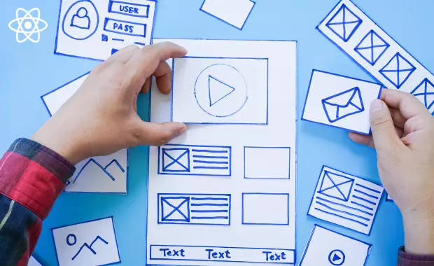

When I first started exploring UI frameworks, it felt like learning a new language. It didn't seem very easy and a bit overwhelming. However, as I began using Bootstrap 5, I started to see how helpful it could be for web development.
Though initially confusing, let's uncover why these UI frameworks can be a game-changer in creating websites.

---

**Dealing with the Initial Challenges**

UI frameworks, like a maze when you first enter, can be tricky to learn. They come with many pre-designed features and styles that can feel like a lot. Figuring out how to use them takes time and patience as you learn their rules and how they work.
But here's the exciting part: once I got the hang of Bootstrap 5, it made things much easier and enjoyable. Think of it like having a set of pre-made building blocks. You can create a fantastic webpage in a fraction of the time it would take if you started using only HTML and CSS from scratch.

---

**Keeping Things Consistent and Easy to Handle**

One of the great things about these frameworks is how they make your website look neat and professional. They follow a particular style, like having a pattern to follow. And when you need to make changes later on, it's way simpler because you only need to do it in one place instead of searching through all your code.
Today, people use all kinds of devices to browse the internet. A UI framework ensures that your website looks good on any screen, whether a big computer monitor or a small smartphone. This adaptability is a big plus for the people visiting your site.

---

**Customizing to Fit Your Vision**

And guess what? Even though there's a structure to these frameworks, they're not set in stone. You can make things look the way you want. You can tweak them and add your style to give your website a unique look, all while saving time.
In a nutshell, UI frameworks seem scary initially, but they're a helpful tool for web developers. They save you time, keep things organized, and ensure your website looks amazing on every device. Bootstrap 5 is great for creating impressive websites without the stress of starting from scratch.
So, take a step forward, try it, and let Bootstrap 5 do your hard work!
