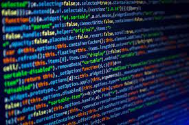

*E10: Reflect on Javascript 1*

  I have mixed feelings about JavaScript as I'm new to using it. Comparing it to other programming languages I know, like Java, C/C++, and Python, I find the concept a bit challenging. I'm not particularly fond of typing every code, even the reserved identifiers. Speaking of learning experiences, delving into ES6 has been enlightening. It's unlike anything I've encountered in my previous programming language studies. Although ES6 has proven to be a challenge, I appreciate how it introduced me to the fundamentals of JavaScript.
When it comes to software engineering, I'm inclined to think that JavaScript might not be the best choice. The need to type out every single word increases the likelihood of making typos. Even the most proficient typists among coders tend to make errors, and the idea of typing out each variable and reserved identifier feels quite frustrating. The pressure of timed quizzes is also quite daunting.

  The practice of WODs (Workout of the Day) has been quite beneficial. They preview what I can anticipate in the actual class WODs. This learning style is unfamiliar, but I'm open to adapting and learning from it. There's definitely stress associated with the unknown expectations of the class. Still, at the same time, I'm excited about the opportunity to explore new languages and concepts. I'm particularly looking forward to creating and sharing a website with the public.

  Overall, I'm optimistic that this learning approach will work well for me. I've been proactive in managing my time. I will invest more time than recommended to thoroughly grasp the concepts. While there's undoubtedly a level of stress involved, the enjoyment of learning something new and the growth potential outweigh the challenges.

