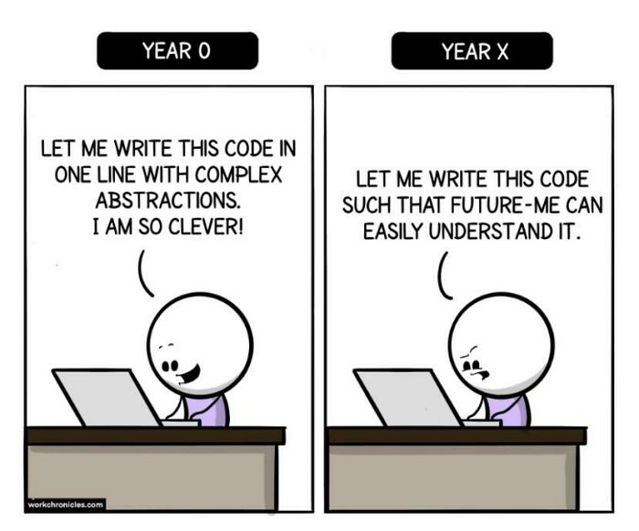

Let's chat about something that sounds boring initially but is super important and quite cool: coding rules, like arranging your code neatly and where to put certain symbols.
These rules might seem small, like tiny puzzle pieces, but they create a big, beautiful picture when you put them all together.
I'm here to share why these rules matter, how they can help you learn to code, and my recent experience using a helpful tool called ESLint in an IntelliJ program.

---

## **Why Coding Rules Are Like Magic**

Imagine coding rules as the special rules in a fun board game. They seem not a big deal, but they can make your game more enjoyable. In the world of computer code:

1. **Good Quality:** Coding rules are like the instructions that help you build a sturdy tower with your building blocks. Following these rules ensures your code is strong and stays intact with bugs.

2. **Easy to Read:** Think of coding rules as the guidelines for drawing a picture. When everyone follows the same rules, it's like everyone speaks the same language, and your code becomes a story that anyone can read and understand.

3. **Teamwork:** Imagine you and your friends are cooking together. Coding rules are like having a recipe that everyone agrees on. It makes cooking together a breeze, and your meal turns out delicious.

4. **Keeping Things Neat:** Just like keeping your room clean makes it easier to find your toys, following coding rules make it simpler to find and fix problems in your code when needed.

---

## **Coding Rules Can Help You Learn**

Now, let's talk about how these coding rules can be like training wheels when you're learning to ride a bike:

1. **Same Steps:** Coding rules are like having a list of steps to follow when learning something new. It's like having a recipe for making a yummy sandwich. You know exactly what to do, step by step.

2. **Smart Tips:** These rules also share tips and tricks, like how to tie your shoelaces faster. They help you avoid mistakes and do things right from the beginning.

3. **Easy Reading:** Learning to write code with coding rules is like learning to write neatly in school. It's easier to read your writing and understand what you're doing.

---

## **My Fun Week with ESLint and IntelliJ**

So, here's what happened when I used a cool tool called ESLint with IntelliJ for a week:

**A Bit Tough, But Helpful:** Imagine you're trying to score points in a game, and it's a bit challenging at first. ESLint can be like that – it points out things in your code that need fixing. It might feel a little tough, but it's like a coach helping you get better.

**Learning Together:** ESLint isn't just a coach; it's also like a teacher. It explains why something is wrong and how to make it right. It's like having a buddy who shows you the ropes.

**Teamwork Wins:** When you and your friends play together, following the same rules makes the game fair and fun. ESLint does that for your coding team. It helps everyone follow the same rules and work together smoothly.

---

In the world of coding, these coding rules are like the secret recipe to create something amazing.
They are like the guide that helps you learn and do things correctly.
Using tools like ESLint in programs like IntelliJ might feel challenging.
Still, it's like leveling up in your favorite video game – you get better, and your code becomes even more awesome.
So, remember, coding isn't just about typing words on a screen; it's about creating something fantastic everyone can enjoy and understand.
Keep following those coding rules, and you'll be a superstar soon!