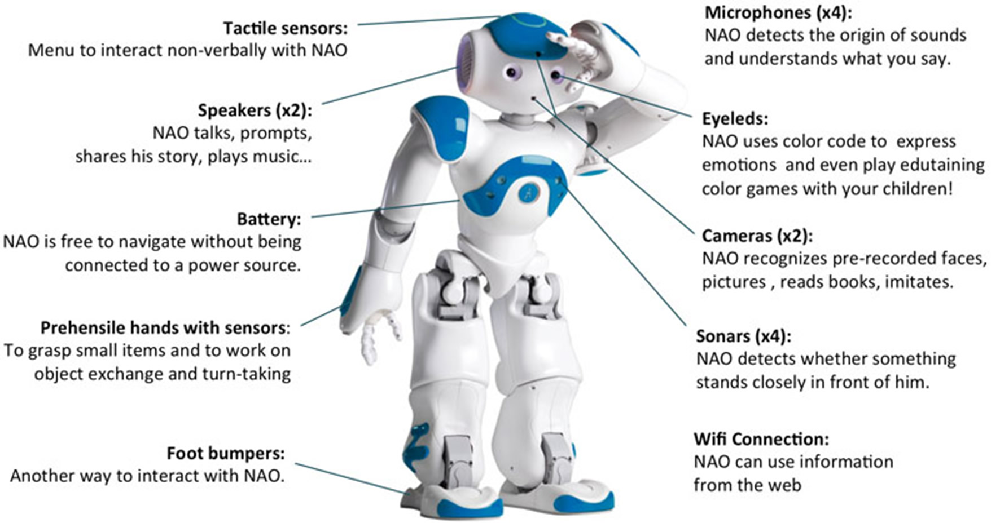

### Meet NAO, a humanoid robot!

For our class research project in SCI 295CS (STEM Research Experience in Computer Science) at Kapiolani Community College, my fellow classmates and I collaborated with the NAO robot. Developed by Aldebaran Robotics in 2005, NAO stands as the pioneering humanoid robot. It is equipped with a multitude of built-in sensors that meticulously replicate human behavior. Currently in its 6th iteration, NAO has gained widespread recognition as the standard robot utilized for educational and research endeavors. Our project embraced a relatively open structure, granting each of us the liberty to delve into the potential applications of programming NAO. As the semester drew to a close, we showcased our work at the Student Undergraduate Research Fair (SURF).

### PROGRAMMING NAO
**Programming NAO offers two approaches through Choregraphe:**

1. Employ a drag-and-drop method, extracting actions from the libraries on the left and arranging them into a flow diagram at the center – similar to Scratch.

2. Construct personalized boxes within Choregraphe and script in the Script Editor. While I utilized Python, NAO accommodates other languages like Java and C++.

NAO's humanoid nature furnishes an array of possibilities. I concentrated on NAO's motion aspect, endeavoring to craft an exercise robot. I orchestrated instances where NAO stood up, elevated its arms, ambulated in various directions, and subsequently manipulated its arms before resuming a seated position.

Engaging with NAO marked my inaugural exposure to robotics. This endeavor enlightened me about utilizing Choregraphe and acquainted me with Python's application in artificial intelligence. Challenges emerged during our interaction with NAO, spanning from connectivity hiccups to facial and voice recognition complications.

  Youtube video: <a href = "https://www.youtube.com/watch?v=hreQpa4dhlA">  "Programming for Basic Artificial Intelligence using NAO Robots and Choregraphe"</a>

