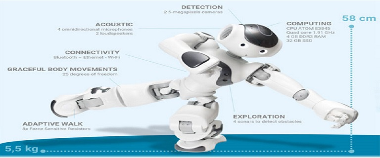

### Meet NAO, a humanoid robot!

As part of our engagement in SCI 295CS (STEM Research Experience in Computer Science) at Kapiolani Community College, my peers and I embarked on an exciting research project involving the NAO robot. Created by Aldebaran Robotics in 2005, NAO is a groundbreaking humanoid robot recognized for its advanced capabilities. Equipped with an array of sophisticated sensors, NAO replicates human behavior with remarkable precision. Evolving into its 6th iteration, NAO has become the standard in educational and research robotics. Our project, which we proudly presented at the Student Undergraduate Research Fair (SURF), explored the diverse applications of NAO programming.

### Exploring NAO Programming 
**Programming NAO offers two approaches through Choregraphe:**

The process of programming NAO was facilitated through Choregraphe, offering two distinctive approaches:
1. **Drag-and-Drop Method:** We harnessed a drag-and-drop interface, drawing actions from the libraries and arranging them into a flow diagram, similar to the visual programming tool Scratch.
2. **Custom Scripting:** In Choregraphe, we crafted personalized modules and utilized the Script Editor to script our actions. While I opted for Python, NAO supports other languages like Java and C++.

**Unleashing NAO's Potential**
 Given NAO's humanoid nature, a world of possibilities emerged. My focus centered on NAO's motion capabilities, with a mission to transform it into an exercise companion. I choreographed sequences where NAO would rise, lift its arms, move in various directions, execute arm maneuvers, and gracefully return to a seated posture.
 
**Navigating the Learning Curve**
 Engaging with NAO marked my initiation into robotics. This endeavor illuminated the mechanics of Choregraphe and introduced me to Python's role in artificial intelligence. The journey was challenging; we encountered issues ranging from connectivity disruptions to facial and voice recognition complexities. My project involved programming NAO to suggest beverages, elaborating on the benefits of each choice. NAO would inquire about tea, juice, coffee, or no-drink preferences. The chosen category would then branch into sub-selections.

**The Art of Categorization** 
Imagine stepping into a world where a friendly robot named Nao becomes your personal drink connoisseur. I've transformed Nao the robot into your personal drink connoisseur, suggesting a range of beverages and spilling the beans on their awesome benefits! Picture this: Nao's ready to play bartender and pops the question – Do you crave tea, juice, coffee, or a daring pass on drinks?

When you engage with Nao, it's like having a conversation with a knowledgeable friend. Nao will eagerly inquire whether you're in the mood for something refreshing like tea, something juicy like fruit blends, or perhaps the invigorating embrace of coffee. And don't worry, if you're just curious and not craving a drink, Nao is here for that, too!

--- 

### Now, let's explore the magical categories that Nao offers:
**The Tea Trek:**
🍵 Embark on a journey of taste and wellness as you explore different types of tea. Nao will guide you through the options. Looking for health benefits? You can choose from varieties like Gyokuro, Dragon Well, Matcha, or Keemun Tea. Craving unique flavors? Delve into the subtleties of Mild teas like White Hair Silver Needle and Golden Monkey Tea or the boldness of Strong teas like Lapsang Souchong, Pu-erh Tea, and Sencha. Seeking tranquility? Nao has stress-relieving options like Jasmine Silver Needle and Jasmine Green Tea. And if you need a caffeine boost, venture into the world of Low or High caffeine content teas. Nao's here to make your tea choices an experience in themselves.

**Juice Jubilee:**
🍹 Dive into the world of vibrant juices, each bursting with its own personality. Nao proudly presents options like zesty Orange Juice, tangy Lemonade Juice, sweet Grape Juice, tangy Cranberry Juice, rejuvenating Tomato Juice, indulgent Prune Juice, and the exotic allure of Pomegranate Juice. It's like a rainbow of flavors ready to tantalize your taste buds.

**Coffee Quest:**
☕ For coffee enthusiasts, Nao serves as your trusty guide through the realms of coffee magic. Do you crave the warmth of a hot cup? Nao offers choices like Black Coffee, Americano, Espresso, Doppio, or Red Eye. And if you're on Team Milk, there's a Latte, Cappuccino, Macchiato, Mocha, Flat White, or Affogato to choose from. But wait, there's more! The iced coffee aficionados are in for a treat with options like Iced Espresso, Cold Brew, Frappuccino, Nitro, or the invigorating Mazagran.

This innovative project isn't just about the drinks; it's about exploring possibilities, embracing technology, and having fun while doing it. So, whether you're in the mood for a soothing cup of tea, a vibrant glass of juice, or the energizing allure of coffee, Nao is here to make your beverage journey memorable and interactive.

---

### Programming Insights: 
While I didn't personally code the Python scripts for execution, I leveraged Choregraphe's preprogrammed functionalities. I utilized the Speech > Creation > Animated Say box to formulate dialogues for NAO's questions. I employed the Creation > Speech Recognition tool to capture specific keywords for user responses. To direct the flow of interactions, I employed the Programming > Logic > Switch Case module, which determined the appropriate response based on the user's selection. This cycle was repeated to realize the complete project.

---

### Navigating Challenges 
Working with NAO was tricky because people talk differently, making it hard for the robot to understand sometimes. But we found ways to improve it by changing how we talk, like talking faster or slower. Also, we had to make sure our words were spelled right, or the robot wouldn't work correctly.
If you're curious and ready for some fun, watch my video. You'll see Nao, the robot, doing some really cool stuff for this project. This project wasn't just a project; it was my gateway to understanding the world of robots, AI, and the thrill of creative problem-solving.

  Youtube video: <a href = "https://www.youtube.com/watch?v=hreQpa4dhlA">  "Programming for Basic Artificial Intelligence using NAO Robots and Choregraphe"</a>

