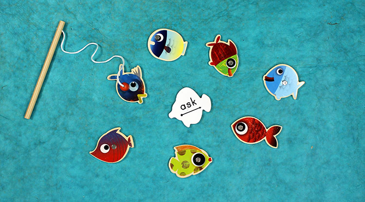

For my final project for my ICS 211 class, I was in a group of three to create a fishing game. The rules for this game were:
1) Two players will alternate turns on the same computer
2) The players will catch fish and put them into a “sack” (an ArrayList, sorted in descending order by length)
3) If the fish is caught, the player will then need to decide whether or not to keep it
4) After 12 turns each, the player with the three largest fish is the winner

<pre>
  
MoiLi_i, Oama, Ohua, and Pua_ama are the name of the fish families we used (these were the parent classes). From this project, I learned a lot about Java, such as inheritance, working with abstract classes, interfaces, etc. This project also taught me a lot about teamwork and how to work together with a group of people for coding.

Player 1, it is your turn! 
* Choose:
  1. Cast out for a fish
  2. View sack of fish
  3. Throw back a fish in the sack.
  
  Choice: 1
   You have hooked a fish!
   You have caught a fish!
     Name: Uhu
     English name: Parrotfish
     Scientific name: Scarus Psittacus
     Length: 12.487740994862454
     Weight: 24.97548198972491
     Body color: blue-green
     Fin color: blue
     Sex: supermale
     
 * Do you want to keep this fish y/n? y
  You have kept your fish
  Your fish is legal and has been added to your sack

Other outcomes would be:
   You have kept your fish
   You kept an illegal fish!
   You got a ticket and all of your fish were confiscated!

or

 Your fish got away!

