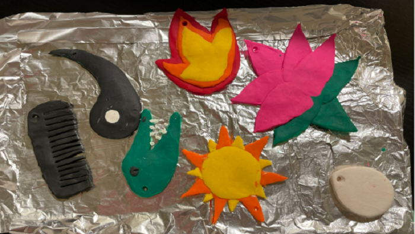

 

### **🌟 The Journey Unveiled**

In this captivating journey, we've explored into the rich tapestry of cultures, spanning China, Taiwan, India, Aotearoa, Hawaii, Native America, the Arctic, and Mesoamerica. I've brought these symbolic treasures to life through the enchanting medium of clay carving.

**Crafting Representation:**
I created a video showcasing the intricate process of hand-carving various iconic symbols with deep cultural meanings. In this project, I carefully selected symbols from different cultures, such as China and Taiwan, India, Aotearoa, Hawaii, Native America, the Arctic, and Mesoamerica. To bring these symbols to life, I chose the art of clay carving as my preferred method. Throughout the video, I take the opportunity to narrate the profound significance behind each iconography.

**🌑 Yin Symbol: Unveiling Feminine Cosmic Power**

The cosmic power of yin is embodied/ by Shiiwang mu through her perfect fulfillment of three distinct roles. The first involves her representation of femininity as a distinguished leader with superior abilities delivered through powerful feminine assertiveness and competent authority. Second, she embodies an appreciation of the female body, particularly in terms of cosmic yin within the body, which is viewed as a replica of the larger universe. In her third role, she exemplifies the power of female sexuality by leveraging it to enhance her feminine inner essences leading to an increase in health, vitality, and beauty.

 * I've known about the Yin Yang symbol, but its meaning was a mystery to me. I appreciate how those who are acquainted with this symbol understand that Yin symbolizes the feminine aspect. The profound significance of darkness is so strong that it can be likened to the vastness of the universe, like the term "celestial."

**🌼 Lotus: Blooming Amidst Adversity**

In both Hinduism and Buddhism, entities who have achieved spiritual transcendence from the material world are often depicted sitting on a lotus. This includes deities, buddhas, and even some humans. The lotus is rooted in muddy water but blossoms above the surface. Its blossom is considered pure and uncontaminated by the mud, thus symbolizing spiritual authority and perfection. (Shree-Lockshmee) Śrī-Lakṣmī is often portrayed not only sitting on a lotus but also wearing a lotus lei, covered in lotuses, the color of a lotus, and even positioned like a lotus. She is also referred to as Padmā or Kamalā, which means “lotus.”

* I've always been fascinated by the lotus flower. It's incredible how it can grow into a beautiful flower even when it starts in muddy waters. The message it conveys has changed my perspective on life. Just like the lotus, even when things seem tough or unattractive, there's still the potential to blossom beautifully.

**🔥 Fire: Stories in Flames**

Fire represents the goddess  Ma-hui-ka because flames blazed from all her fingernails and toenails. One day the demi-god Māui attempted to outwit her which nearly destroyed him. After asking her for all her flaming fingernails and toenails (and secretly extinguishing each of them in a nearby stream) she caught on to his trick and in a fit of rage threw her last one at him, accompanied by an incantation, which caused the flame to ignite everything around him. In frantic desperation, Māui pleaded with his storm and rain ancestors to save him, which they did. After the flames were extinguished, a small seed of her fires remained in certain trees, most notably the kaikomako tree. It is these types of trees that some Māori still use today to create a fire.

* I'm aware that fire holds many symbolic meanings, but hearing this viewpoint shifts my understanding. Fire is crucial for us, and the fact that a part of Mahuika lives within the Kaikomako tree is truly fascinating. It's amazing that people still use it to create fire even today.

**🥚 Egg: Birth of New Beginnings**

Pele’s youngest sister is Hiʻi-aka-i-ka-poli-o-pele. She was born from the palms of Haumea’s hands in the shape of an egg. The egg represents all embryos whose existence is dependent on Pele’s creation of new land. Her name implies how Pele (which means “lava” in Hawaiian) holds her in her bosom as she takes root before growing out of the lava, representing the essence, reflection, or by-product of a volcanic eruption. The literal translation of her name is “causative of growth on or in lava.” Because she is attributed to growth (both spiritually and physically), she is also considered a healer who not only heals the land after Pele has poured over it but also heals people through her personification of overcoming challenges and her attributes associated with the growth of medicinal plants.

* An egg has always symbolized new life, and the fact that a goddess was born in the form of an egg confirms this idea. I often mention that we shouldn't underestimate eggs. Despite their simplicity, they carry a profound meaning of life.

**☀️ Sun: Measure of Time and Spirituality**

The Cherokee deity who is the sun is known as Six Killer. A major function of the sun for horticultural-based communities like the Cherokee is to measure time. These measurements are essential for the Cherokee Nations’ prosperity and spiritual survival. The Cherokee used the sun as the basis for their calendars. It marked daily and seasonal positions in time which were utilized for both farming as well as ceremonial purposes. Ceremonial utilizations include knowing what day and hence which spiritual currents or forces are operative during that time. The measurement of harmonious and balanced behavior (i.e. administration of justice) is often carried forth by clan matrons and it is this deity who epitomizes all of these types of measurements. 

* The sun shines brightly, and it's essential for our lives. I'm intrigued by how the Cherokee people ingeniously use the sun to track time, create calendars, and decide the seasons for optimal farming and special ceremonies. 

**🖌️ Comb: Restoring Harmony**

For the Inuit, their Sea Mother is most commonly known in Western studies of sacred stories and religion as Sedna. She controls all the hunted sea animals/ that the Inuit need to survive. If humans do not treat these animals with respect and honor them through the appropriate rituals, then the Sea Mother withholds them from human access. In order to appease her when she is upset with humans, a shaman will venture to the bottom, of the sea where she resides. Once the shaman arrives, she or he will comb her hair which has been tangled by the misdeeds of humans. This is especially pleasing to her because this particular goddess has lost all her fingers and so she is not able to grasp a comb herself. After being appeased by the shaman in this manner, she returns the animals to be hunted again.

* If I put this story in different words, it's fascinating how a comb is employed to unravel human mistakes. It's like trying to correct the wrongs people do, and that's a truly powerful characteristic.

**🐊 Alligator: Earth's Dual Nature**

The earth itself embodies the Nahua concepts of duality and fluidity through its personification as an alligator. She/he is seen as both a loving and nurturing mother as well as a carnivorous and destructive monster. Descended from the heavens, this deity was perceived to be a snapping and biting female-male savage beast known as  (si-pactli)Cipactli. The Nahua likens the earth’s surface to the slippery and rough ridged back of an alligator with its mountains and deep creviced valleys, particularly evident within the mountainous regions of Mexico. Moral teachings associated with this deity indicated that upon walking on her/his surface, one must tread very cautiously and maintain a balance between her/his extremes in order to achieve a harmony of tensions. This implies adhering to appropriate behavior while enjoying earthly pleasures in order to maintain cosmic order.

* When you come across an alligator, the initial feeling is often fear. However, beneath its intimidating look, it represents a caring and protective mother, which is not something one would immediately think of. This is a great illustration of the saying "don't judge a book by its cover." There's usually a positive aspect behind someone's negative exterior.

In this journey of exploring these iconic symbols, I've gained a newfound appreciation for the depth and richness they bring to various cultures. Each carving not only captures the intricate details of these symbols but also encapsulates the stories and meanings that have shaped civilizations across time.

  
  

